This is the webpage of WPI CS 539 (Machine Learning) final project.

Group Member:

Jiaming Nie, Ruojun Li, Yu Li, Yang Tao, Guangda Li

# Introduction To Style Transfer

Style transfer is the technique of recomposing images in the style of other images. Three images will be taken, a content image, a style image and output image.

Deep convolutional neural network is a powerful tool to extract the feature which represents the styles. The style could be the structure of one painting, the way artists draw their paintings and the colors that the artists use. Representation of content images can also be extracted using the deep convolutional neural network.

A style transfer demo is illustrated on the following image:

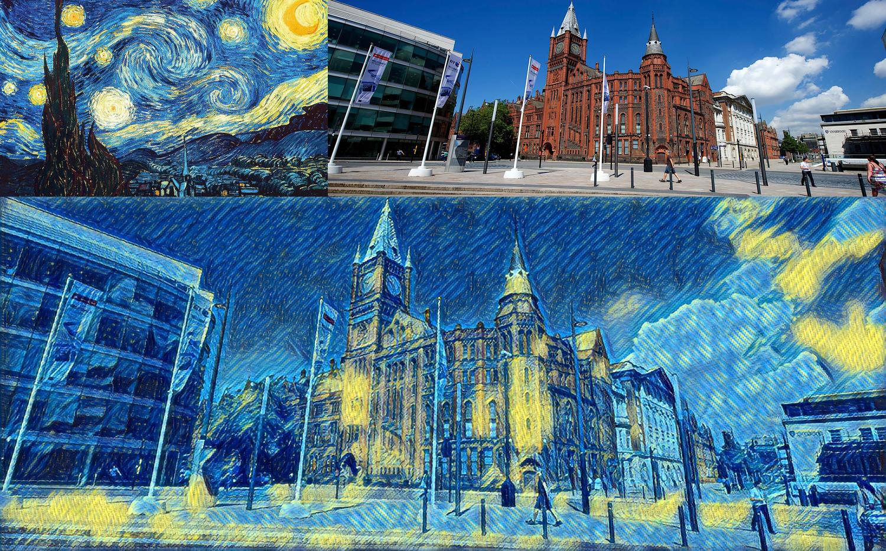

# Images Representation

## Use Pre-trained CNN to generate activation maps

Deep convolutional neural network can output the activation map, which are features representing the content or style of an image. In this project, a ImageNet pretrained vgg16 network will be used to output the feature at different layers.

VGG 16 is a deep CNN including 5 convolutional layers, 2 fully connetced layers and 1 softmax output layer. In this project, only the convolutional layers will be used as they will output the activation maps.

The architecture of VGG16 is on the following:

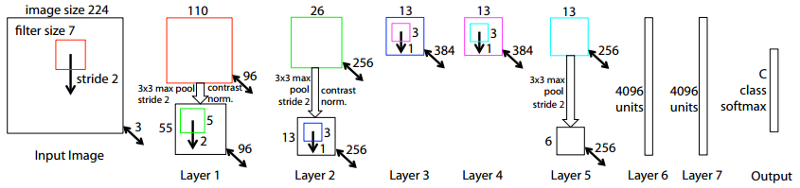

VGG16 takes 224 as the input size and all the convolutional layers are hidden layers.

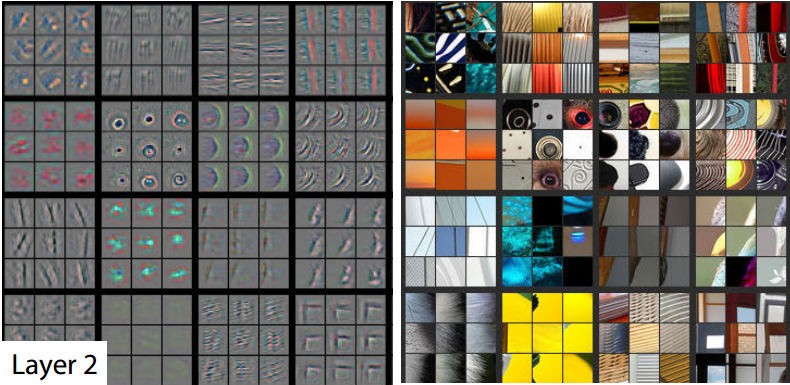

Layer 2 of the CNN. The left image represents what the CNN has learned and the right image has parts of actual images.

* In layer 2 of the CNN the model is already picking up more interesting shapes than just diagonal lines. In the sixth square (counting horizontally) you can see that the model is picking up circular shapes. Also, the last square is looking at corners.


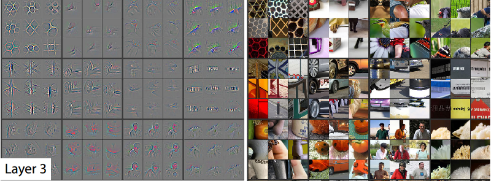

* In layer 3 we can see that the model is starting to learn more specific things. The first square shows that the model is now able to recognize geometrical patterns. The sixth square is recognizing car tires. And the eleventh square is recognizing people.

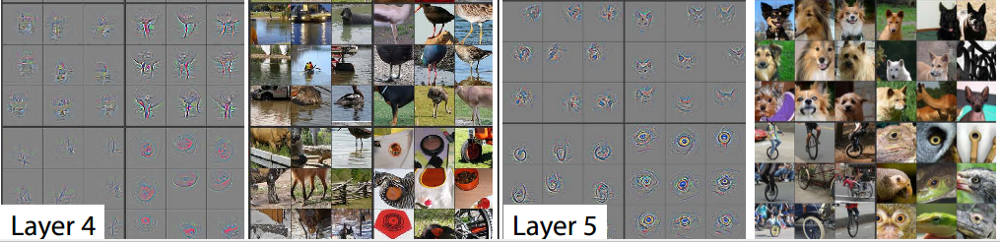

* Finally, layers 4 and 5 continue this trend. Layer 5 is picking up tings that are very useful for our dogs and cats problem. It is also recognizing unicycles and bird/reptile eyes. Be aware that these images only show a very small fraction of things learned by each layer.

As the network went deeper, the features became more high-level and abstrated for human to recongnize. The pretrained vgg16 will be able to filter out the objects in one image.

## Representation of Content

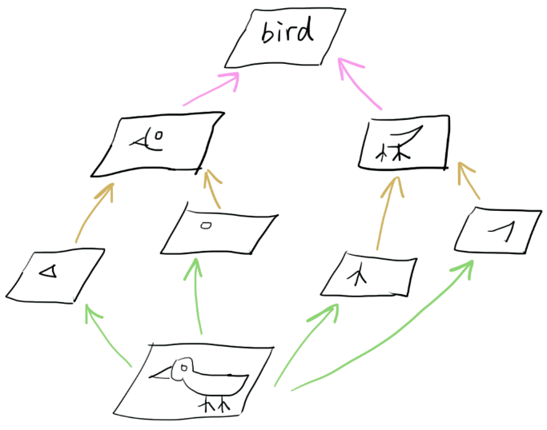

The structure of the content image could be easily extracted using the output of the last convolutional layer of vgg16.

## Representation of Style

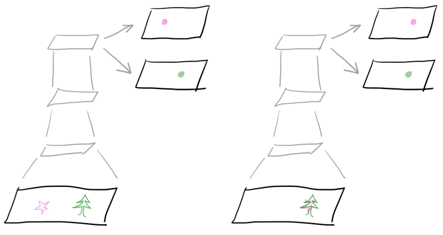

Similarly, the style of one image could also be extratced using the same method.

## Feature and Gram Matrix

The activation map is a combined matrix which are high-level features human can easily recongnize.

In style transfer, network need to convert them into another shape for the traning and testing procedure.

* First, convert the activation map into feature matirx.

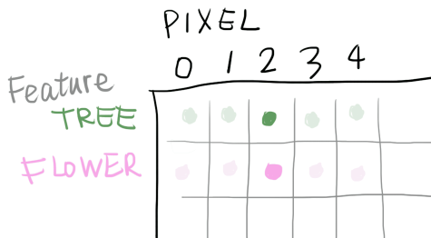

Each row of feature matrix represents different features, each column represent each pixel in activation map.

The feature matrix contains all the inforamtion in style image.

Another information needs to be known is the relationship between different features. The inner product of the feature matrix could describe the relationship in a clear manner. The new matrix is named as gram matrix.

In python, the gram matrix could be easily calculated (F is feature matrix):

	
```
def Gram(F):
    return np.dot(F.T, F) / F.size
```

* The gram matrix is illustrated on the following. Each element in the gram matrix will represent 2 features on the row and column respectively.

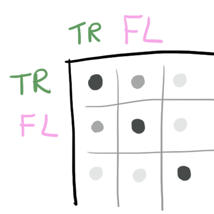

If one element on the gram matrix is large, the relation between these 2 features will be stronger. For example, in one cell, the row represent the tree, the column is flower, the value is larger means this artist prefers the combination of tree and flower.

The size of gram matrix is only determined by the number of feature map. In style transfer, the input size is not strictly defined.

# Training Progress

The whole process is showed on the following.

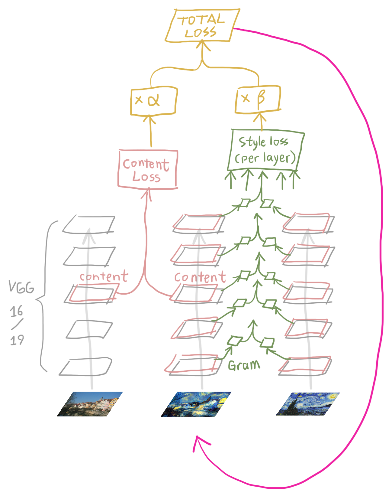

* In the forward propagation, input the style image and content image into the network, extracted the feature.

* For each the content image, the content loss is determined as the the sum of all the training images.

* The cost function is the sum of the style loss and content loss.

* In the forward propagation, compute the gradient of total loss over the content image. Take the gradient descent until total loss converges.

* The content loss is a determined value defined by the training images.

## Minimize the loss

The calculation equation of the style loss and content loss is actually the equation of mean square function (MSE).

## MSE Equation

In the training the loss will be the Mean Square Error (MSE) equation. 


## Definition of Total Loss

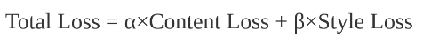

## Training Loss Plot

* The loss plot in the training progress. It only takes 4 epoches, approximately 320000 iterations.

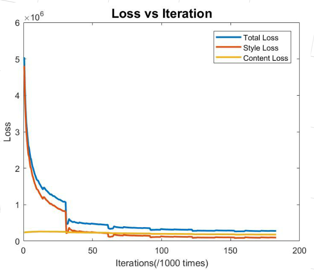

# Conclusion

* VGG 16 was used to extract the feature and reconstruct images.

* Training the network takes very long time, a light CNN may be used for time reduction.

* The tune of parameter α and β to change the output.

# Demo Video

The real-time demo video is here:

https://www.youtube.com/watch?v=5WqvDl81Cj0s

Or referenced the gif:


# Training Dataset
The training dataset uses the Microsoft COCO 2014 dataset.

The size of the dataset is 14GB which has 80000 images in total.

# GitHub Page
https://github.com/jmnie/CS539-ML-18F-Project

# Presentation Slides
https://prezi.com/kxdwilsggigw/machine_learning_pre/?utm_campaign=share&utm_medium=copy
