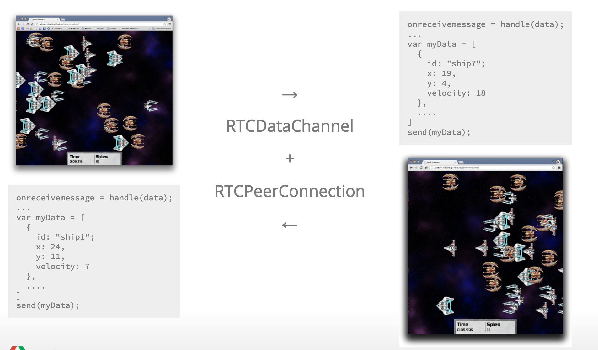

This blog is about the notes of the WebRTC of an internal knowledge sharing. This blog will only discuss about high-level architecture and API in WebRTC.

# WebRTC in A Nutshell

## WebRTC: Web Real-time Communication

> "_WebRTC is a new front in the long war for an open and unencumbered web._"

    ----- Brendan Eich, Mozilla CTO and inventor of JavaScript

## Brief Functionalities

- Open Source Project, providing browsers, mobile applications with simple API.
- Supports direct peer-to-peer audio and video communication inside web pages.
- Standards published by W3C and IETF (Internet Engineering Task Force).
- Developed in C++ and JavaScript.

## WebRTC Architecture (Framework)


## WebRTC Applications Acorss Platforms

- Chrome
- Chrome on Android
- FireFox
- Opera
- And ** IE ** doesn't support WebRTC.


## Main Tasks of WebRTC

- Acquiring audio and video
- Communicating audio and video
- Communicating arbitrary data

# WebRTC JavaScript API

In this section, three main JavaScript API will be discuessed here, which are:

- MediaStream (getUserMedia)
- RTCConnection
- RTCDataChannel

## MediaStream (getUserMedia)

- Represent a stream of audio and/or video
- Can contain multiple 'tracks'
- Obtain MediaStream with navigator.getUserMedia()


### JavaScript API Sample

```
var constraints = {video: true};

function successCallback(stream) {
  var video = document.querySelector("video");
  video.src = window.URL.createObjectURL(stream);
}

function errorCallback(error) {
  console.log("navigator.getUserMedia error: ", error);
}

navigator.getUserMedia(constraints, successCallback, errorCallback);
```

A simple demo here: https://andrei.codes/ascii-camera/

## RTCPeerConnection: Audio and Video Communication between Peers


### RTCPeerConnection Does A Lot

- Signal Processing
- Codec Handling
- Peer to Peer Communication
- Security
- Bandwidth Management

```
pc = new RTCPeerConnection(null);
pc.onaddstream = gotRemoteStream;
pc.addStream(localStream);
pc.createOffer(gotOffer);

function gotOffer(desc) {
  pc.setLocalDescription(desc);
  sendOffer(desc);
}

function gotAnswer(desc) {
  pc.setRemoteDescription(desc);
}

function gotRemoteStream(e) {
  attachMediaStream(remoteVideo, e.stream);
}
```

A simple demo: https://simpl.info/rtcpeerconnection/

## RTCDataChannel: Birdirectional Communication of Arbitrary Data Between Peers


