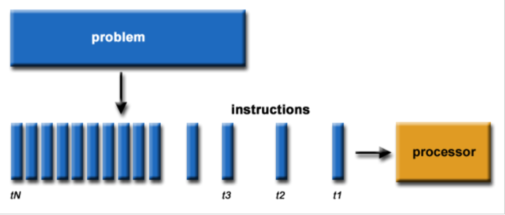
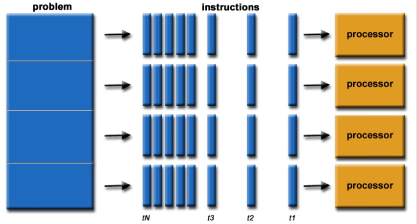
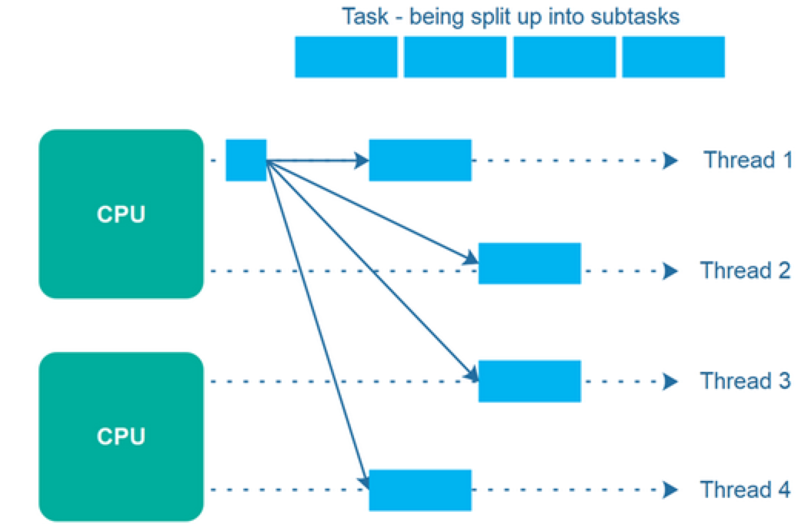
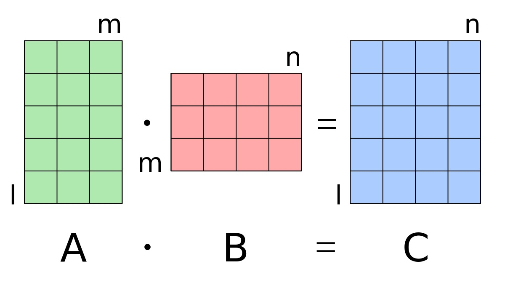
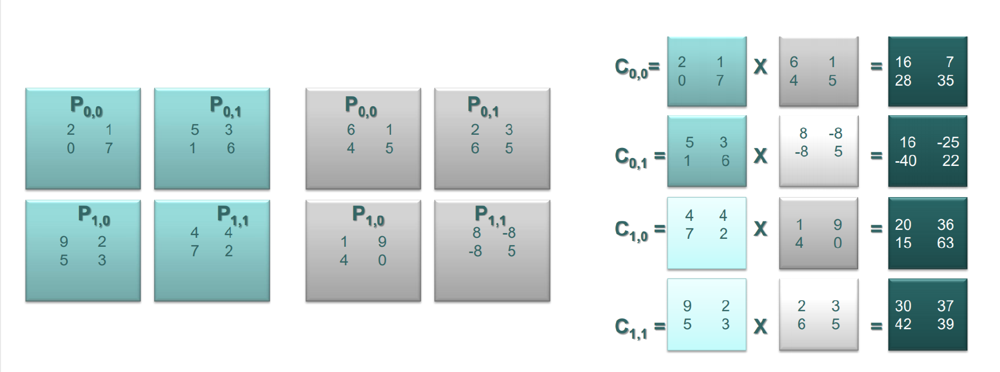
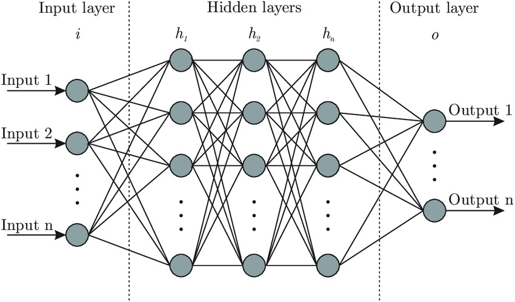
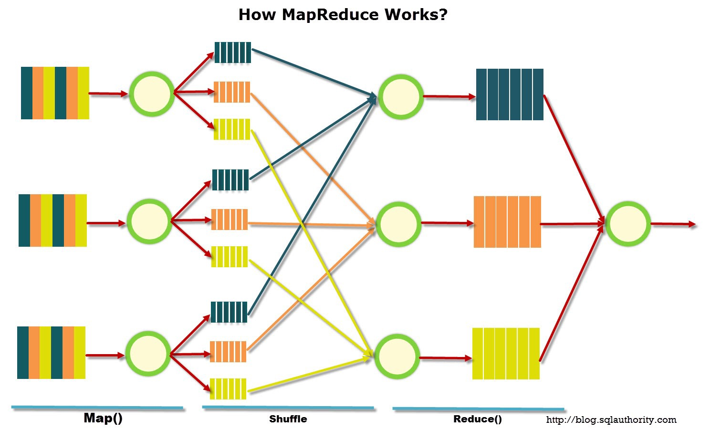
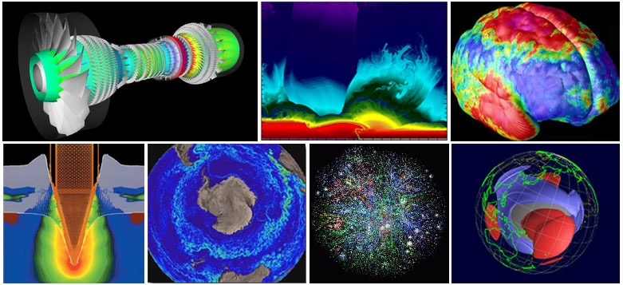
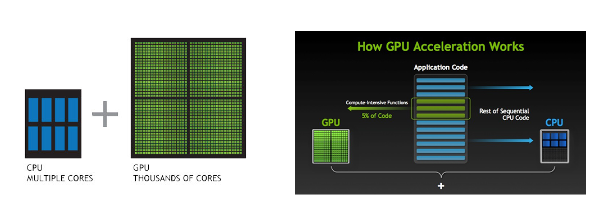

This blog is about some basic concepts of parallel computing. It includes the concept and comparison between serial computing and parallel computing. 

# Serial Computing 

- A problem is broken into a discrete series of instructions
- Instructions are executed sequentially one after another
- Only one instruction may execute at any moment of time

# Parallel Computing

- Be divided into sub-problem which can be solved simultaneously
- Execute multiple program instructions at any moment in time
- High e ciency with multiple computation resources than single computation resource

# Parallelism vs. Concurrency

## Concurrency

- Concurrency, application making progress on more than one task.
- Concurrency means executing multiple tasks at the same time but not necessarily simultaneously.

## Parallelism

- Parallelism means that an application splits its tasks up into smaller subtasks which can be processed in parallel, for instance on multiple CPUs at the exact same time (simultaneously).

## Matrix Multiplication Using Parallel Methods

### Matrix Computation 

Sequential Algorithm
- Using nested loops in Code, time Complexity *O(N3)*

### Parallel Methods

Parallel Algorithm

- Divided Matrix A and B into small blocks
- Using parallel loops in Code, time Complexity O(M*N2)

## Neural Network: Initialize, Compute and Update Parameters

- Output = Input * HiddenParameters
- Number of parameters is pretty huge

## Map-Reduce: Large-Scale Matrix Multiplication

- Parallel and distributed algorithm processing big data sets.
- Proposed by Google, implemented in Hadoop and Spark.

# Application Scenraio 

Scenarios that require processing large amounts of data in sophisticated
way.
- "Big Data", databases and data mining
- Artificial Intelligence
- Pharmaceutical design
- Financial and economic modeling

## GPU and Parallel Computing

- GPUs are designed to handle parallel processing more e ciently.

## CUDA - Compute Uni ed Device Architecture

- A parallel computing platform and programming model that enables dramatic increases in computing performance by harnessing the power of the graphics processing unit (GPU).
- Developed and released by NVIDIA in 2006
- Can run on all of NVIDIA's latest discrete GPUs
- Extension of the C, C++, and Fortran languages
- Operating Systems that Support it: Windows XP and later, Linux, and Mac OS X