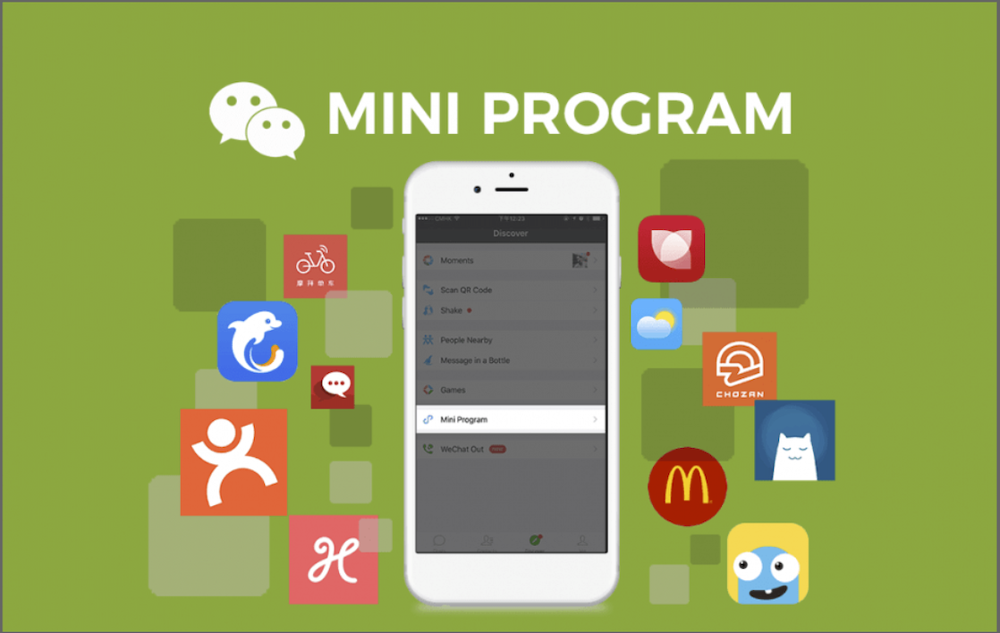
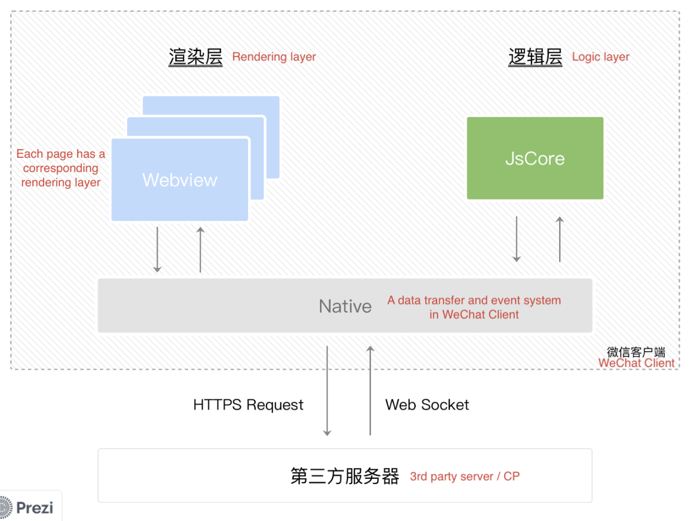
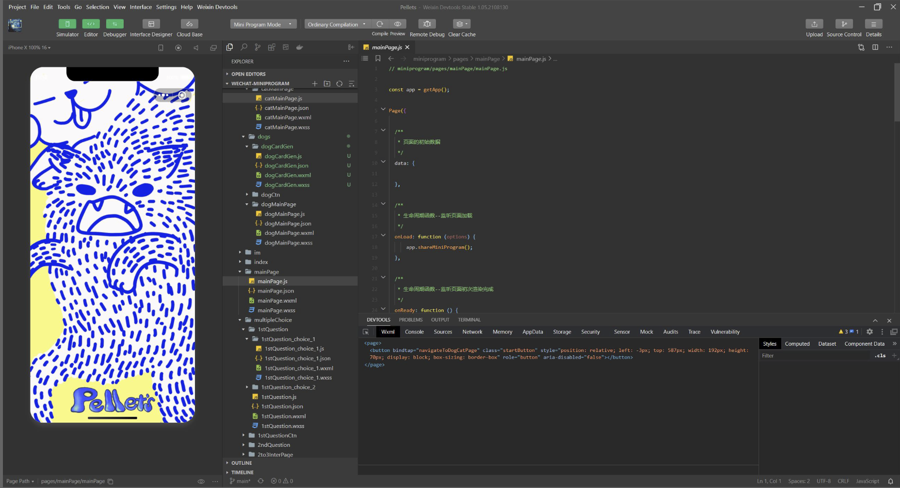
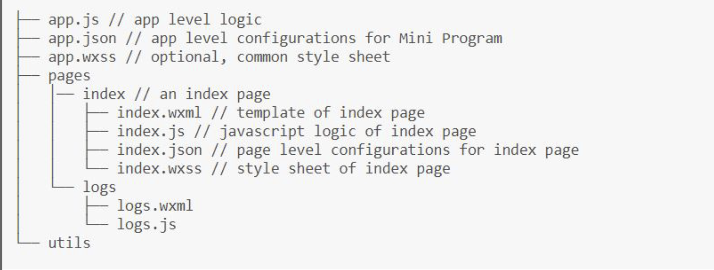
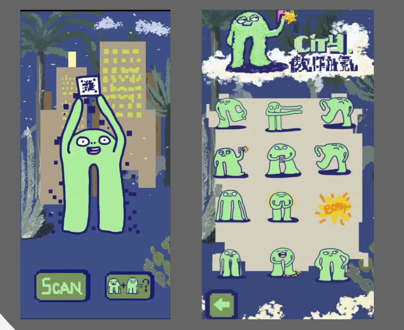
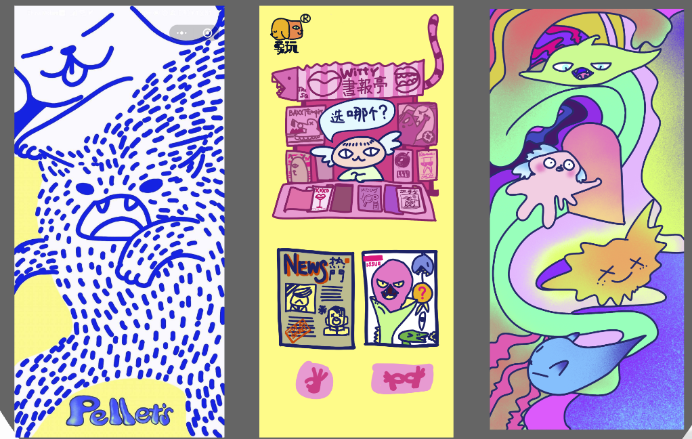

This blog is about WeChat Mini-Program development. This blog will not dive very deep about the usage of API and related development toolchains. It will focus on high-level stuff. Some parts of the content were presented in work. 

# WeChat Mini-Program Status Quo 

- Over 400 million Daily active users
- Over 3.5 million Mini-Programs
- Over 60% of WeChat users use Mini-Programs

# Development View of WeChat Mini-Program

This part is about the development view of the Mini-Program. It's generally about the structure, project kernal and project structure. 

## WeChat Mini-Program Runtime 

- Rendering Layer: WXML & WXSS (HTML & CSS)
- JavaScript is the Development Language 

## WeChat Mini-Program Project Kernel

- iOS, iPad OS & Mac OS: JavaScriptCore & WKWeb View

- Android: V8 & XWeb

- Windows (Win WeChat): Chrome core

- IDE on Windows: NW.js & Chromium Webview

### Sample Screenshot of IDE

## WeChat Mini-Program Project Structure

- In App.js,  global data object will be stored here. 

- In Pages, the first page will be indexed as the Main page.

# Portfolio 

In 2021, I colloborated with [Hikaru](https://www.instagram.com/inuhikru/) and we successfully launched two mini-programs. Thank you Hikaru, hope we can continue cooperating in the future!

## Matrix Scan 

Matrix scan is a mini-program launched for a small exhibition. Participants can use this miniprogram to unlock different icons designed for the exhibition. (Designer: [Hikaru](https://www.instagram.com/inuhikru/))

## PelletCat

PelltCat is a miniprogram of a small game for identification testing. You can search "PelletCat" in WeChat and launch the app, play with it.

# Load Testing on WeChat Mini-Program

- Using JMeter

- WeTest - An Official WeChat Testing Framework

# Slides Link

Here is the slide version of this blog: [Slides](https://prezi.com/view/AVc0ZGhMkUtyBuBelO7z/)